<body >
<h1>UART communication between STM32F407 and Atmega328p(UNO)</h1>

<strong style="font-size:20px">
We will be using STM32F407VET6 and Atmega328p as a transmitter and receiver respectively for UART communication.
</strong>

<section>
<h2>Contents</h2>
<ul  style="background-color:#c5d4cc;padding-top: 10px;padding-bottom: 10px;">

<li><a href="#about"><h3>About UART</h3></a></li>
<li><a href="#comp"><h3>Components</h3></a></li>
<li><a href="#conn"><h3>Connections</h3></a></li>
<li><a href="#code"><h3>Code Explanation</h3></a></li>
<li><a href="#exp"><h3>Final Result</h3></a></li>
</li>
</ul>
</section>

<section id="about">
<h2>About UART</h2>
<strong style="font-size:20px">
Universal asynchronous receiver-transmitter(UART) is a asynchronous serial communication between devices. It is a serial communication between a single master and slave. It is asynchronous i.e it does not contain a clock. Settings of both the TX and RX should be same in order to have a proper communication.

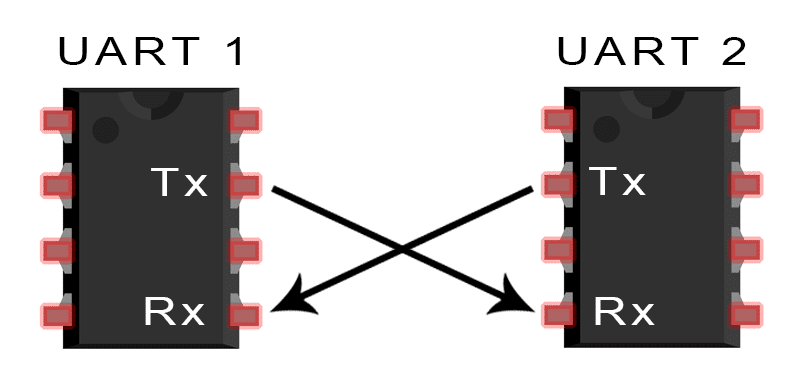

<h3>Baud rate</h3>
Baud rate is the number of signals per second. It is important to set the same baud rate on tx and rx side. commonly used baud rates are 9600,57600,115200.

<h3>Data Transmission</h3>
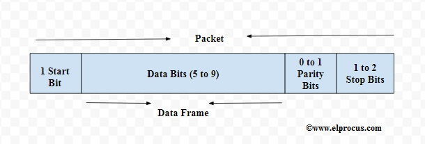

<h4>Start Bit</h4>
Normally UART transmission line is held high when not transmitting. When transmission begins UART line is held low for one clock cycle, this indicates the UART that transmission has started.

<h4>Data Bits</h4>
Data bits contains the data that is being sent, it can be of size from 5 to 9 bits, if no parity is used. If a parity is used it can be of size from 5 to 8.

<h4>Parity Bit</h4>
Parity Bit is used to set the parity type i.e even or odd parity. parity is used to count the number of '1' bits in the transmitted data. If parity bit is 0, then the number of '1' bits in the transmitted data should be even, if parity bit is 1, then count should be odd. Parity bit is used to check the error in the receiving side, if the parity is even, but RX  parity is odd , then there is a change of bits in the data frame. 

<h4>Stop Bits</h4>
Stop bit is used to end the data transmission, it can of size 1 or 2.
</section>

<section id="comp">
<h2>Components</h2>
<ul>
<li><h5>Arduino UNO(Atmega328p)</h5></li>
<li><h5>STM32F407VET6</h5></li>
<li><h5>CP2102 (USB to TTL)</h5></li>
</ul>
</section>

<section id="conn">
<h2> Connection </h2>
Connect PA2(tx) of STM32F407VET6 to Digital Pin 0 (RX) of UNO.
Also Connect PA2(tx) to CP2102 (USB to TTL) to observe the transmitted data. 
</section>

<section id="code">
<h2>Code Explanation</h2>

<h3>Transmitter code(STM32F407VET6)</h3>
In uart2_config function Clock and uart are configured

<code>

RCC->APB1ENR |= RCC_APB1ENR_USART2EN; //Enable UART clk
	
RCC->AHB1ENR |= RCC_AHB1ENR_GPIOAEN;  //Enable GPIO A

</code>

Here clock is enabled for uart2 and GPIO A. PA2 and PA3 are TX and RX pins of UART2.

<code>

	GPIOA->MODER |= GPIO_MODER_MODE2_1|GPIO_MODER_MODE3_1; //Set mode as Alternate function mode
	
	GPIOA->MODER &=  ~(GPIO_MODER_MODE2_0)| ~(GPIO_MODER_MODE3_0);

	GPIOA->OSPEEDR |= GPIO_OSPEEDER_OSPEEDR2_0 |GPIO_OSPEEDER_OSPEEDR2_1|GPIO_OSPEEDER_OSPEEDR3_0|GPIO_OSPEEDER_OSPEEDR3_1; //very High speed for pin2 and 3;

	GPIOA->AFR[0] |= 0x00007700UL; //Alternate AF7(usart2) for pin and Alternate AF8(usart2) for pin2
	
</code>

Here GPIO port mode for pin 2 and 3 is set to alternate function as we are using these pins for UART.

GPIO output speed for pin 2 and 3 is set to very high speed.

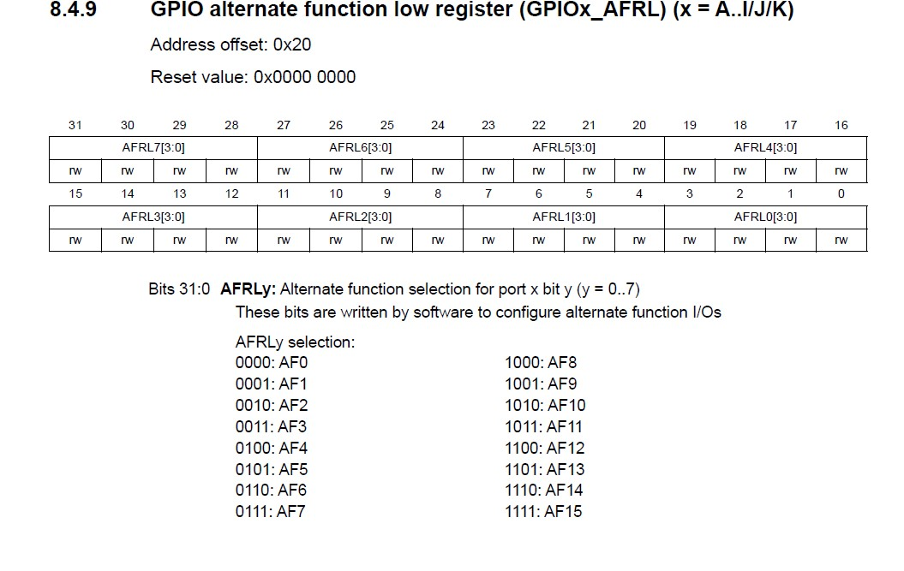
GPIO alternate function for Pin 2 and 3 is set to '7' as alternate function for UART is AF7.

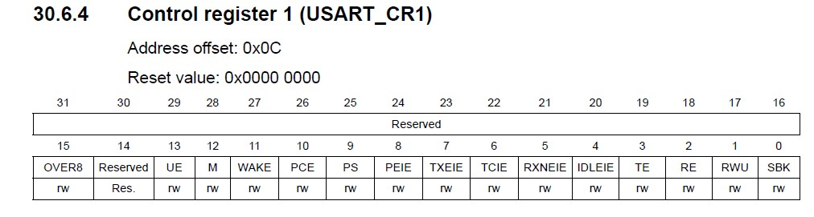

<code>

USART2->CR1 = 0x00;
	
USART2->CR1 |= USART_CR1_UE; //usart enable
	
USART2->CR1 &= ~(USART_CR1_M);; //8-bit word length

USART2->CR1 |= USART_CR1_RE; //rx enable
	
USART2->CR1 |= USART_CR1_TE;//tx enable

</code>

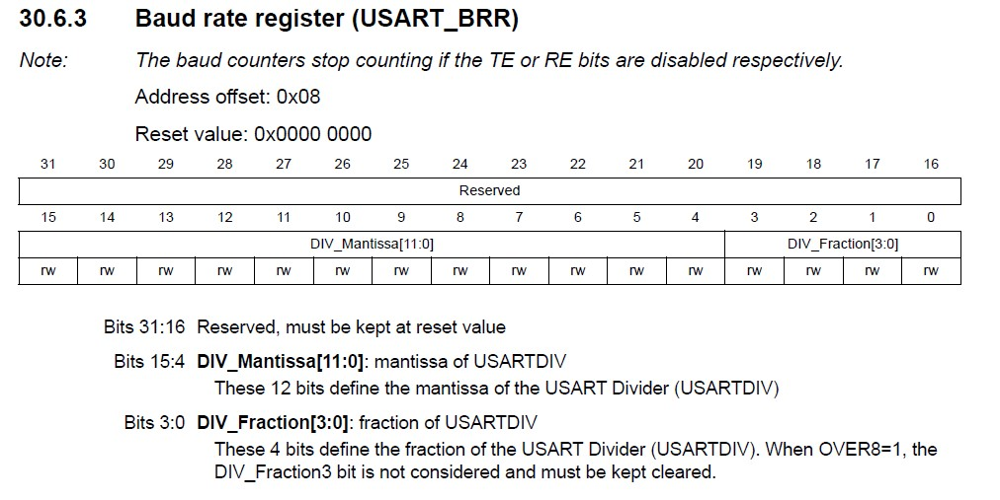

<code>
USART2->BRR = (3<<0) | (104<<4); //baud rate of 9600 at 16Mhz
</code>
	

<h4>Baud rate calculation </h4>
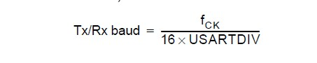

Here fck=16Mhz, Tx/RX baud = 9600
USARTDIV = ((16mhz)/(16x9600)) = 104.13

104 goes in into DIV_Manitissa of BRR.
Fraction is 0.13 , 0.13x16= 2.56 =3(aprrpox) goes into fraction part of BRR.
 

<h4>NOTE</h4>
 check clock frequency of APB1 bus and make calculation as required.
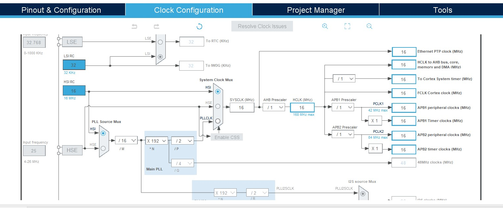

<code >

void send_char(unsigned char data){
	
	USART2->DR = data;
	
	while(!(USART2->SR & (USART_SR_TC))); //Wait for tx complete
}

</code>

This function is used to transmit the data.
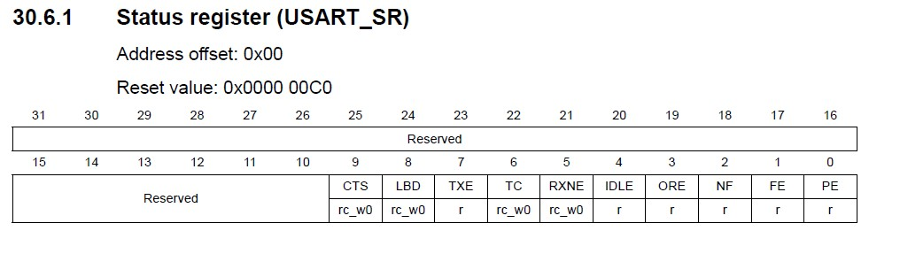

while(!(USART2->SR & (USART_SR_TC))) //loop waits till transmission complete bit is set in the status register.

<code>

while (1)
	
  {
    /* USER CODE END WHILE */
	
	  send_string(data);
	
	  delay1();
	
    /* USER CODE BEGIN 3 */
	
  }

</code>

In Main function , call send_string function to send the data.
<h3>Receiver code (Atmega328p)</h3>
<code>

volatile char *UCSR0_A = (char *)0xC0; // Control and status register A
	
volatile char *UCSR0_B = (char *)0xC1; // Control and status register B
	
volatile char *UCSR0_C = (char *)0xC2; // Control and status register C
	
volatile short *UBBR_0 = (short *)0xC4; // Register to set Baud rate 
	
volatile short *UDR_0   = (short *)0xC6; // Data Register 

</code>

Here, we initialized the address of the registers to used, Control and status register A and B are used to check the status of the UART. Control and status register C is used to select the mode,parity,stop bits and synchronous/asynchronous transmission. UBBR register is used to set the baud rate. UDR register is used for data buffer.

<code>

void init_USART(){

  *UCSR0_B = 0x10;
  *UCSR0_C = 0x06;
  *UBBR_0 = 104; 
}

</code>

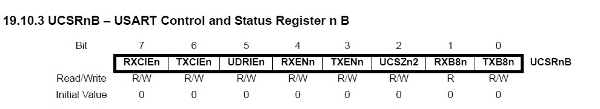

In Control and status register B, Receiver Enable (bit-4) is set.

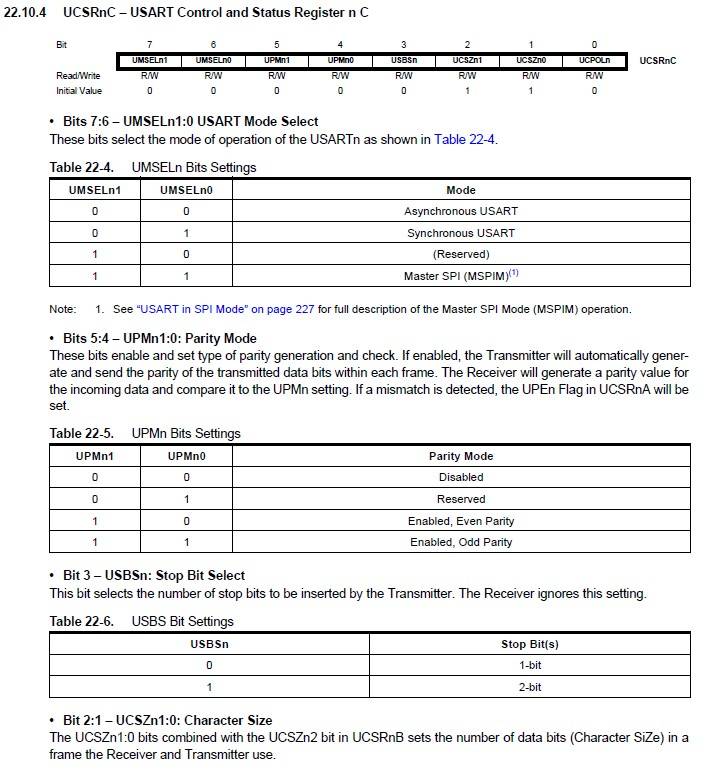
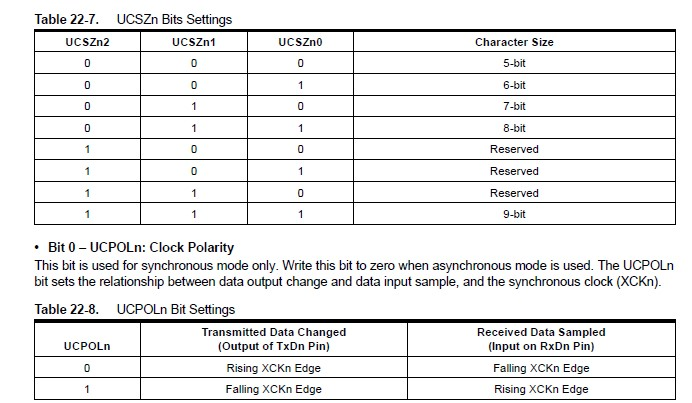

In Control and status register C, Asynchronous USART is select, Parity is disabled, 1-bit stop is selected, character size of 8-bit is selected, clock polarity is not required as we are using asynchronous transmission.

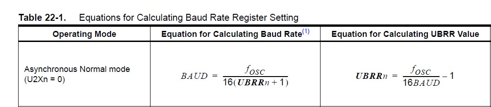

Baud rate calculation:
BAUD = 9600;
fosc = 16Mhz;

UBBR = ((16mhz)/(16x9600))-1
UBBR = 103.16 = 104 is selected

<code>

unsigned char usart_rx()
	
{
	
  while (((*UCSR0_A)&0x80)==0);
	
  return *UDR_0;
	
}

</code>

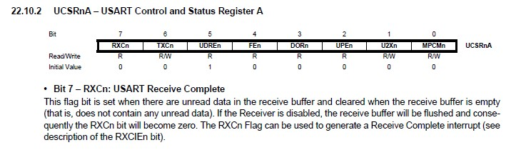

This function is send the received data once the reception is completed.
while (((*UCSR0_A)&0x80)==0) waits till the USART receive complete Bit in Control and status register A is cleared and then received data in the UDR register is returned.

<code>

void setup() {
	
  init_USART();
	
  char x;
	
  while(1){
	
    x = usart_rx();
	
    Serial.print(x);
	
  }
	
}

</code>

This is the main function, x variable is used to store the received data and printed.

</section>

<section id="exp">
h2>Final Result</h2>
	
<h4>Transmitter</h4>
Connect tx pin of stm32 to the CP2102 rx pin. Connect the CP2102 to USB port of PC. Download <a href="https://www.hw-group.com/software/hercules-setup-utility">
Hercules Utility</a> 

Open Hercules Utility, select serial, choose COM port,baud rate as 9600 and press OPEN.

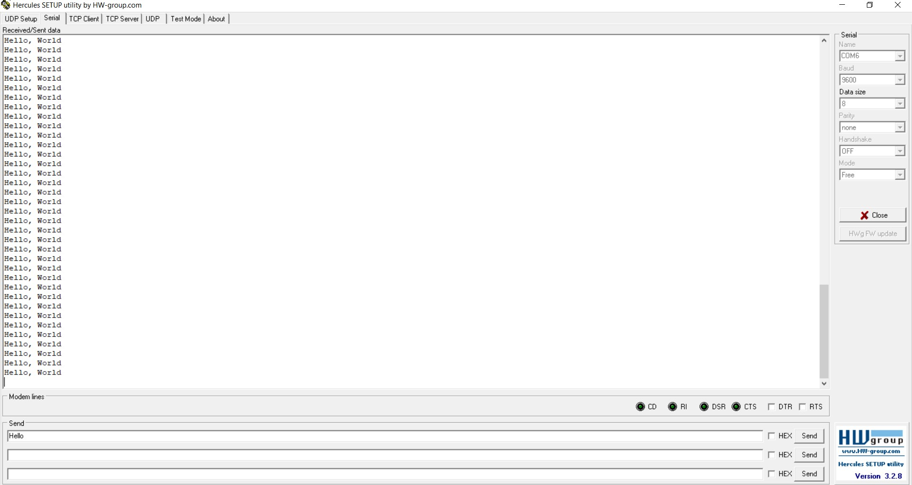

<h4>Receiver</h4>
Open Arduino IDE and Serial monitor, choose baud rate as 9600.
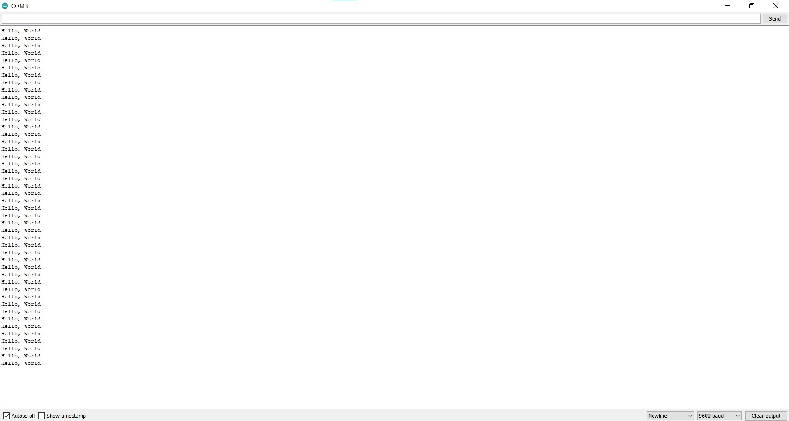
</section>

